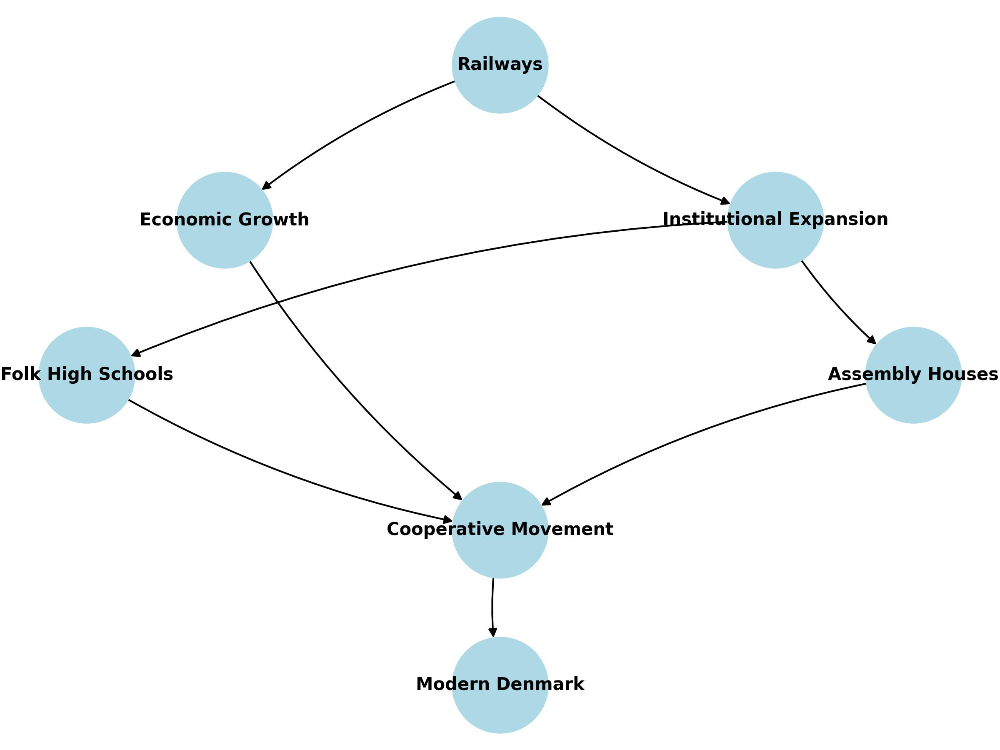

# Tracks to Modernity: Railroads, Growth, and Social Movements in Denmark

This is the public repository of *Tracks to Modernity: Railroads, Growth, and Social Movements in Denmark* by *Tom Görges (TU Dortmund University), Magnus Ørberg Rove (University of Copenhagen), Paul Sharp (University of Southern Denmark), and Christian Vedel (University of Southern Denmark)*

This paper shows how Denmark's railways not only accelerated economic transformation, but also fostered civic engagement and the proliferation of key institutions, shaping the country's long-term development trajectory.

$\rightarrow$ [Full paper on arXiv](https://arxiv.org/abs/2502.21141)  


<details>
  <summary>How to cite (click to expand)</summary>

  > Görges, T., M. Ørberg Rove, P. Sharp, and C. Vedel (2025). Tracks to Modernity: Railroads, Growth, and Social Movements in Denmark. Unpublished manuscript.
  
  ```bibtex
  @misc{görges2025tracksmodernityrailroadsgrowth,
      title={Tracks to Modernity: Railroads, Growth, and Social Movements in Denmark}, 
      author={Tom Görges and Magnus Ørberg Rove and Paul Sharp and Christian Vedel},
      year={2025},
      eprint={2502.21141},
      archivePrefix={arXiv},
      primaryClass={econ.GN},
      url={https://arxiv.org/abs/2502.21141}, 
}

  ```
</details>



-------------

The scripts in this repository are numbered to indicate the order in which to run them. Some of the data cannot be shared in this repository either because I am not authorized to redistribute it, or because it is too large. However, I have included all the necessary information to download or obtain the data below. All scripts from "101\_..." onwards require only data that is included in the repository.

The numbering of the scripts indicate running order. The first digit indicate level of analysis. Everything starting with 0, e.g. 002_Linking_geo_data.R processes raw data. Everything starting with the digit 1 are scripts intended to output data which is used in the analysis. Scripts starting with 2 outputs results which are found in the paper or appendix.


## 1. Included data

The following data is included in this repository

### A. Census_data.csv

Parish level demographic statistics based on digtized census data from Link Lives, available at www.rigsarkivet.dk/udforsk/link-lives-data/. The data contains the following variables:

| Variable              | Description                                                                                              |
|-----------------------|----------------------------------------------------------------------------------------------------------|
| Year                  | Census year                                                                                              |
| GIS_ID                | Unique identifier for each parish, which links to the shape data                                         |
| Pop                   | Population in parish 												|
| Pop_f                 | Female population in parish											|
| Pop_m                 | Male population in parish 											|
| Age_mean        	| Mean age                                                                					|
| Born_different_county | Number of people born in a different county                                                              |
| hisco_majordigit[x]    | Number of people with first digit of their HISCO code [x]. See <https://historyofwork.iisg.nl/major.php> |
| Child_women_ratio     | Ratio of children to women |
| Manufacturing_789     | Number of People working in occupations with HISCO codes starting with 7, 8, or 9 |
| Farming  		| Number of People working in occupations with HISCO codes starting with 6 |
| hiscam_avg  		| Average HISCAM      |                                                    


### B. Geo_info.csv

This contains various geographic information.

| Variable             | Description                                      |
|--------------------------------|----------------------------------------|
| GIS_ID               | GIS_ID - unique ID in the parish shape data.  |
| Parish               | Parish Name 					|
| Hundred              | Hundred of the parish 				 |  
| County               | County of the parish                     	 |                                                                                        
| Dist_coast		| Distance to closest coast in meters    |
| coastal		| Only parishes with \<5km distance to a coast |    
| dist_hmb		| Distance to Hamburg in meters         |
| dist_cph		| Distance to Copenhagen in meters       |                                     
| Boulder_clay_pct      | Percentage of the land area that is covered by boulder clay    |                                                           
| area_parish		| Total land area |
| Distance_market_town	| Distance to closest market town in meters |
| Closest_market_town	| GIS_ID of closest market town  |
| DistOxRoad		| Distance to Ox Road (Hærvejen)                                                           |

### C. Hoejskoler_clean_panel.csv

This dataset contains information on folk high schools (højskoler) in Denmark, including their geographical locations and operational duration.

| Variable  | Description |
|-----------|------------------------------------------------------------------------------------------------------------------------|
| Year      | Year of observation in the dataset. A school may appear multiple times if it existed over multiple years. |
| id        | Unique identifier for each folk high school. |
| lat       | Latitude coordinate of the school's location. |
| long      | Longitude coordinate of the school's location. |
| Start     | The founding year of the folk high school. |
| End       | The year when the school ceased operation. |
| Duration  | The total number of years the school was in operation. |


### D. Huse.Rdata

This dataset contains information on assembly houses, including their locations, construction years, affiliations, and distances to key cities.

| Variable               | Description |
|------------------------|-----------------------------------------------------------------------------------------------------|
| ID                    | Unique identifier for each building. |
| Edition               | Edition of the source document from which the data is taken. |
| Vol                   | Volume in which the building is recorded. |
| Page                  | Page number in the source document. |
| Amt                   | County (Amt) where the building is located. |
| Sogn                  | Parish (Sogn) where the building is located. |
| Hus                   | Type of building (e.g., Missionshus, Forsamlingshus). |
| Evt_navn              | Name of the building (if available). |
| Opfoert_aar           | Year of construction. |
| Evt_tilhoersforhold   | Religious or organizational affiliation (e.g., IM, LM, Adv). |
| Observed again        | Indicates whether the building was observed in later editions. |
| lat                   | Latitude coordinate. |
| long                  | Longitude coordinate. |
| fra                   | Start date of documented observation period. |
| til                   | End date of documented observation period. |
| Cluster               | Cluster identifier for spatial analysis. |
| enhedid               | Unique unit identifier. |
| distance_copenhagen   | Distance to Copenhagen (in km). |
| distance_harbooerer   | Distance to Harboøre (in km). |
| distance_aarhus       | Distance to Aarhus (in km). |
| distance_skanderup    | Distance to Skanderup (in km). |

### E. Huse_panel.Rdata

This dataset provides a panel structure of mission houses and assembly houses (missionshuse and forsamlingshuse) in Denmark over time.

| Variable               | Description |
|------------------------|-----------------------------------------------------------------------------------------------------|
| Amt                   | County (Amt) where the building is located. |
| Sogn                  | Parish (Sogn) where the building is located. |
| Year                  | Year of observation. |
| Missionshuse          | Number of mission houses in the parish in that year. |
| Forsamlingshuse       | Number of assembly houses in the parish in that year. |
| objectid              | Unique parish identifier. |
| lat                   | Latitude coordinate. |
| long                  | Longitude coordinate. |
| cluster               | Cluster identifier for spatial analysis. |
| long_tmp              | Temporary longitude transformation for spatial processing. |
| X_km                  | X-coordinate in transformed spatial units (km). |
| Y_km                  | Y-coordinate in transformed spatial units (km). |
| distance_copenhagen   | Distance to Copenhagen (in km). |
| distance_harbooerer   | Distance to Harboøre (in km). |
| distance_aarhus       | Distance to Aarhus (in km). |
| distance_skanderup    | Distance to Skanderup (in km). |
| distance_hedensted    | Distance to Hedensted (in km). |


### F. MDS_DM_merge_w_add_data.csv

This dataset contains historical data on Danish creameries, including their geographic locations, production details, shareholder structures, and infrastructure characteristics. Sourced from Bentzen et al (2023) and Sharp et al (2023)

| Variable               | Description |
|------------------------|-----------------------------------------------------------------------------------------------------|
| Creamery_ID           | Unique identifier for each creamery. |
| Latitude_new          | Latitude coordinate of the creamery. |
| Longitude_new         | Longitude coordinate of the creamery. |
| Year                 | Year of observation. |
| Creamery_name        | Name of the creamery. |
| Region_merged        | Geographical region where the creamery is located. |
| Dairy_association    | Dairy association affiliation. |
| Established_year     | Year the creamery was founded. |
| Years_since_est      | Number of years since establishment. |
| Production_days      | Number of production days in the given year. |
| Production_year_start | Start date of the production year. |
| Production_year_end   | End date of the production year. |
| Cost_acquisitions    | Cost of acquisitions related to the creamery. |
| Amortization         | Recorded amortization values. |
| Funds                | Available financial funds for the creamery. |
| Cost_construction    | Cost associated with constructing the creamery. |
| Fire_insurance       | Value of fire insurance coverage. |
| Debt                 | Amount of debt held by the creamery. |
| Shareholders_start   | Number of shareholders at establishment. |
| Shareholders_now     | Number of shareholders in the observed year. |
| Cows_start           | Number of cows at establishment. |
| Cows_now             | Number of cows in the observed year. |
| Daily_milk_start     | Daily milk production at establishment. |
| Daily_milk_last      | Daily milk production in the observed year. |
| Milk_fat            | Percentage of milk fat content. |
| MB_ratio            | Ratio of milk to butter production. |
| Extraction_pct      | Percentage of extracted milk fat. |
| Price_butter        | Price of butter in the observed year. |
| Collection_routes   | Number of milk collection routes. |
| Distance_to_railway | Distance to the nearest railway station. |
| Icehouse_size       | Size of the creamery’s icehouse. |
| Refrigeration       | Type of refrigeration used. |
| Milk_for_butter     | Amount of milk used for butter production. |
| BovineTB_programme  | Participation in the bovine tuberculosis eradication program. |
| Electricity         | Indicator of whether the creamery used electricity. |
| Energy_source       | Type of energy used (coal, firewood, peat, etc.). |
| Butter_export       | Amount of butter exported. |
| Distance_copenhagen | Distance to Copenhagen (in km). |
| Distance_harbooere  | Distance to Harboøre (in km). |
| Distance_aarhus     | Distance to Aarhus (in km). |

### G. Market_towns.csv

This data was manually compiled based on the following wikipedia page: <https://da.wikipedia.org/wiki/K%C3%B8bst%C3%A6der_i_Danmark>

The data was enriched with data from Degn (1989) and www.ddb.byhistorie.dk

| Variable            | Description                                                            |
|--------------------------------|----------------------------------------|
| Market_town         | Name of market town                                                    |
| Market_townID       | Unique ID for each market town                                         |
| Pop1672             | Population in 1672                                                     |
| Pop1769             | Population in 1769                                                     |
| Pop1787             | Population in 1787                                                     |
| Pop1801             | Population in 1801                                                     |
| GIS_ID              | Key to use for census data and shape data. Manually added              |
| Coastal             | Is the market town close to the coast?                                 |
| Limfjord_coast      | Is the market town on the Limfjord?                                    |
| Manually_added      | Not in Degn (1989). Was added from ddb.byhistorie.dk                   |
| wiki_ref            | Wikipedia URL                                                          |
| Coord               | Latitude and longitude from wikipedia                                  |
| Privilege_start     | When was market town privilege given?                                  |
| Privilege_end       | When was market town privilege taken away?                             |
| Informal_markettown | Towns that in all but official recognition acted as market town        |
| Approx_year         | Is the privilege given in an approximate year?                         |
| Port_projects       | Years separated by ','. Year of port construction projects from Trap 3 |
| ddb_url             | Page on ddb.byhistorie.dk                                              |
| Notes               | Notes                                                                  |

### H. Opened_pairs.csv

This dataset contains information on the opening years of railway connections between Danish towns. It is used for constructing the least cost paths (LCPs) for our instrument.

| Variable         | Description |
|-----------------|-------------------------------------------------------------------------------------------------|
| town_pair       | Names of the two towns connected by the railway segment. |
| town_pair_id    | Unique identifier for each town pair. |
| opened         | Year the railway connection between the two towns was opened. |

This dataset is critical for analyzing the expansion of railway infrastructure in Denmark and its role in shaping economic and social developments.

### I. OxRoads.csv

This dataset contains information on the distance of parishes to the historic Ox Road (Hærvejen), an important medieval trade and travel route in Denmark. Data on the distances from ox roads comes from Boberg-Fazlic et al (2023).

| Variable      | Description |
|--------------|---------------------------------------------------------------|
| GIS_ID       | Unique identifier for each parish. |
| DistOxRoad   | Distance to the Ox Road (Hærvejen) in meters. |


### J. Panel_of_MA_assembly_houses.csv

This dataset provides a panel structure of the local density of assembly houses (market access) across parishes over time.

| Variable  | Description |
|-----------|---------------------------------------------------------------------------------------------------|
| Year      | Year of observation. |
| GIS_ID    | Unique identifier for each parish, linking to the geographic shape data. |
| MA        | Local density of assembly houses (market access measure). |


### K. Panel_of_MA_folk_high_schools.csv

This dataset provides a panel structure of the local density of folk high schools (market access) across parishes over time.

| Variable  | Description |
|-----------|---------------------------------------------------------------------------------------------------|
| Year      | Year of observation. |
| GIS_ID    | Unique identifier for each parish, linking to the geographic shape data. |
| MA        | Local density of folk high schools (market access measure). |


### L. Panel_of_assembly_houses.csv

This dataset provides a panel structure of assembly houses in Danish parishes over time, tracking their presence and location.

| Variable       | Description |
|---------------|------------------------------------------------------------|
| Year          | Year of observation. |
| Parish        | Name of the parish where the assembly house is located. |
| Assembly_house | Indicator variable (0/1) for the presence of an assembly house. |
| cluster       | Cluster identifier for spatial analysis. |
| long          | Longitude coordinate of the parish. |
| lat           | Latitude coordinate of the parish. |
| GIS_ID        | Unique identifier for each parish, linking to the geographic shape data. |


### M. Panel_of_folk_high_schools.csv

This dataset provides a panel structure of folk high schools in Danish parishes over time, tracking their presence and location.

| Variable     | Description |
|-------------|------------------------------------------------------------|
| GIS_ID      | Unique identifier for each parish, linking to the geographic shape data. |
| HighSchool  | Indicator variable (0/1) for the presence of a folk high school. |
| long        | Longitude coordinate of the parish. |
| lat         | Latitude coordinate of the parish. |
| Year        | Year of observation. |


### N. Panel_of_railways_in_parishes.csv

This dataset tracks railway connectivity across Danish parishes over time.

| Variable                   | Description |
|----------------------------|------------------------------------------------|
| GIS_ID                     | Unique identifier for each parish, linking to the geographic shape data. |
| Connected_rail             | Binary indicator (0/1) of whether the parish had a railway connection in a given year. |
| Year                       | Year of observation. |
| Distance_to_nearest_railway | Distance (in km) to the closest railway line. |


### O. REGRESSION_DATA_Demography.csv

This dataset is used for regression analysis and contains information on railway access, geography, and demographic characteristics of Danish parishes over time. It includes various indicators relevant to economic and social transformation.

| Variable                                      | Description |
|-----------------------------------------------|-------------|
| GIS_ID                                        | Unique identifier for each parish, linking to the geographic shape data. |
| RailAccess                                    | Binary indicator (0/1) of whether the parish had railway access in a given year. |
| Year                                          | Year of observation. |
| RailDist                                      | Distance (in km) to the nearest railway line. |
| Connected_rail_StateTrunk                     | Binary indicator (0/1) of whether the parish was connected to a **state trunk** railway line. |
| Distance_to_nearest_railway_StateTrunk        | Distance (in km) to the closest **state trunk** railway line. |
| Connected_rail_StateNonTrunk                  | Binary indicator (0/1) of whether the parish was connected to a **state non-trunk** railway line. |
| Distance_to_nearest_railway_StateNonTrunk     | Distance (in km) to the closest **state non-trunk** railway line. |
| Connected_rail_Private                        | Binary indicator (0/1) of whether the parish was connected to a **private** railway line. |
| Distance_to_nearest_railway_Private           | Distance (in km) to the closest **private** railway line. |
| LCPAccess                                     | Binary indicator (0/1) of whether the parish had railway access based on **least-cost paths (LCP)**. |
| LCPDist                                       | Distance (in km) to the nearest railway line based on **least-cost paths (LCP)**. |
| Assembly_house                                | Binary indicator (0/1) for the presence of an assembly house in the parish. |
| cluster                                       | Cluster identifier for spatial analysis. |
| MA_assembly                                   | Local market access measure based on the density of assembly houses. |
| HighSchool                                    | Binary indicator (0/1) for the presence of a folk high school in the parish. |
| MA_folkhigh                                   | Local market access measure based on the density of folk high schools. |
| Parish                                        | Name of the parish. |
| Hundred                                       | Hundred (administrative division) where the parish is located. |
| County                                        | County where the parish is located. |
| Dist_coast                                    | Distance to the nearest coastline (in meters). |
| coastal                                       | Binary indicator (TRUE/FALSE) if the parish is located within 5 km of a coastline. |
| dist_hmb                                      | Distance to Hamburg (in meters). |
| dist_cph                                      | Distance to Copenhagen (in meters). |
| Boulder_clay_pct                              | Percentage of land area covered by **boulder clay**, affecting agricultural productivity. |
| area_parish                                   | Total land area of the parish. |
| Distance_market_town                          | Distance to the nearest **market town** (in meters). |
| Closest_market_town                           | GIS_ID of the nearest market town. |
| DistOxRoad                                    | Distance to **Hærvejen (Ox Road)**, a historic trade route (in meters). |
| Pop1787                                       | Population of the parish in the year 1787. |
| Pop1801                                       | Population of the parish in the year 1801. |
| Population                                    | Total population of the parish in the observed year. |
| Pop_f                                         | Female population. |
| Pop_m                                         | Male population. |
| Age_mean                                      | Mean age of the population. |
| Migration                                     | Number of people born outside the county. |
| hisco_major0-9                                | Number of people employed in occupations corresponding to the first digit of their **HISCO** code (0-9). |
| Child_women_ratio                             | Ratio of children to women. |
| Manufacturing_789                             | Number of people employed in occupations with **HISCO codes 7, 8, or 9** (manufacturing, transport, trade). |
| Farming                                       | Number of people employed in occupations with **HISCO code 6** (agriculture). |
| HISCAM_avg                                    | Average **HISCAM** social status score for the parish. |
| lnPopulation                                  | Log-transformed total population. |
| lnManufacturing                               | Log-transformed number of people in manufacturing. |
| lnFarming                                     | Log-transformed number of people in agriculture. |
| lnChild_women_ratio                           | Log-transformed ratio of children to women. |
| lnHISCAM_avg                                  | Log-transformed average HISCAM score. |
| lnMigration                                   | Log-transformed number of migrants (people born outside the county). |
| Year_num                                      | Numeric year variable. |
| GIS_ID_num                                    | Numeric GIS_ID variable. |
| Boulder_clay_decile                           | Decile of boulder clay coverage. |
| Boulder_clay_pct_year                         | Boulder clay coverage for the specific year. |
| Dist_hamb_decile                              | Decile of distance to Hamburg. |
| Dist_hamb_year                                | Distance to Hamburg for the specific year. |
| Dist_cph_decile                               | Decile of distance to Copenhagen. |
| Dist_cph_year                                 | Distance to Copenhagen for the specific year. |
| Dist_ox_decile                                | Decile of distance to Ox Road. |
| Dist_ox_year                                  | Distance to Ox Road for the specific year. |
| Dist_mt_decile                                | Decile of distance to market towns. |
| Dist_mt_year                                  | Distance to market towns for the specific year. |
| Pop1801_decile                                | Decile of the 1801 population. |
| Pop1801_year                                  | Population in 1801 for the specific year. |
| area_decile                                   | Decile of parish area size. |
| area_parish_year                              | Parish area size for the specific year. |
| county_by_year                                | County identifier interacted with year. |
| Treat_year                                    | Year in which the parish was treated (i.e., gained railway access). |
| Treat_year_instr                              | Instrumented treatment year for robustness checks. |
| NotAgriculture                                | Number of people employed outside of agriculture. |
| lnNotAgriculture                              | Log-transformed number of people employed outside of agriculture. |
| min_distance_to_node_km                       | Minimum distance to a **network node** (e.g., railway station, market town) in kilometers. |
| away_from_node                                | Binary indicator (0/1) if the parish is 10km from a node. |
| invalid_comparison                            | Indicator for invalid comparisons. |


### P. REGRESSION_DATA_Grundtvigianism.csv

This dataset is used for regression analysis and contains information on railway Access and Grundtvigianism.

| Variable                                      | Description |
|-----------------------------------------------|-------------|
| GIS_ID                                        | Unique identifier for each parish, linking to the geographic shape data. |
| RailAccess                                    | Binary indicator (0/1) of whether the parish had railway access in a given year. |
| Year                                          | Year of observation. |
| Distance_to_nearest_railway                   | Distance (in km) to the nearest railway line. |
| Connected_rail_StateTrunk                     | Binary indicator (0/1) of whether the parish was connected to a **state trunk** railway line. |
| Distance_to_nearest_railway_StateTrunk        | Distance (in km) to the closest **state trunk** railway line. |
| Connected_rail_StateNonTrunk                  | Binary indicator (0/1) of whether the parish was connected to a **state non-trunk** railway line. |
| Distance_to_nearest_railway_StateNonTrunk     | Distance (in km) to the closest **state non-trunk** railway line. |
| Connected_rail_Private                        | Binary indicator (0/1) of whether the parish was connected to a **private** railway line. |
| Distance_to_nearest_railway_Private           | Distance (in km) to the closest **private** railway line. |
| LCPAccess                                     | Binary indicator (0/1) of whether the parish had railway access based on **least-cost paths (LCP)**. |
| Distance_to_nearest_railway_instr             | Distance (in km) to the nearest railway line based on **instrumented least-cost paths (LCP)**. |
| parameter                                     | Specific parameter related to Grundtvigianism. |
| Assembly_house                                | Binary indicator (0/1) for the presence of an assembly house in the parish. |
| cluster                                       | Cluster identifier for spatial analysis. |
| MA_assembly                                   | Local market access measure based on the density of assembly houses. |
| HighSchool                                    | Binary indicator (0/1) for the presence of a folk high school in the parish. |
| MA_folkhigh                                   | Local market access measure based on the density of folk high schools. |
| Parish                                        | Name of the parish. |
| Hundred                                       | Hundred (administrative division) where the parish is located. |
| County                                        | County where the parish is located. |
| Dist_coast                                    | Distance to the nearest coastline (in meters). |
| coastal                                       | Binary indicator (TRUE/FALSE) if the parish is located within 5 km of a coastline. |
| dist_hmb                                      | Distance to Hamburg (in meters). |
| dist_cph                                      | Distance to Copenhagen (in meters). |
| Boulder_clay_pct                              | Percentage of land area covered by **boulder clay**, affecting agricultural productivity. |
| area_parish                                   | Total land area of the parish. |
| Distance_market_town                          | Distance to the nearest **market town** (in meters). |
| Closest_market_town                           | GIS_ID of the nearest market town. |
| DistOxRoad                                    | Distance to **Hærvejen (Ox Road)**, a historic trade route (in meters). |
| Pop1787                                       | Population of the parish in the year 1787. |
| Pop1801                                       | Population of the parish in the year 1801. |
| Year_num                                      | Numeric year variable. |
| GIS_ID_num                                    | Numeric GIS_ID variable. |
| Treat_year                                    | Year in which the parish was treated (i.e., gained railway access). |
| Treat_year_instr                              | Instrumented treatment year for robustness checks. |
| decade                                        | Decade variable for time trends. |
| Treat_year_broad                              | Broad treatment year category. |
| Treat_year_instr_broad                        | Broad instrumented treatment year category. |
| min_distance_to_node_km                       | Minimum distance to a **network node** (e.g., railway station, market town) in kilometers. |
| away_from_node                                | Binary indicator (0/1) if the parish is 10km from a node. |
| invalid_comparison                            | Indicator for invalid comparisons. |


### Q. Source Hoejskoler.txt
Contains source information for the folk high schools.

### R. creameries_parish.csv
| Variable       | Description |
|-------------------|-------------|
| Creamery_ID   | Unique identifier for each creamery. |
| long         | Longitude coordinate of the creamery. |
| lat          | Latitude coordinate of the creamery. |
| GIS_ID       | Unique identifier for each parish, which links to the shape data.   |


### S. distance_to_nodes.xlsx
| Variable       | Description |
|-------------------|-------------|
| GIS_ID       | Unique identifier for each parish, which links to the shape data.   |
| min_distance_to_node_km         | Minimum distance from the parish to the nearest network node in kilometers. |


### T. key.Rdata
This file provides a mapping between different spatial identifiers and geographic locations.


## 2. Scripts
Here is a short description of each script and its functionality:

| Name                              | Description                                                               |
|-----------------------------------|---------------------------------------------------------------------------|
| `000_Functions.R`                	| Functions used in the rest of the project.                                								|
| `001_Read_data.R`			| Reads data.       															|
| `002_Railway_data.R`          	| This script adds a function to calculate stats for Railways and parishes given two shape files: Parish shapes and Railways shapes.	|
| `003_Assembly_houses.R`          	| Cleans data on assembly houses									                               	|
| `004_Folk_high_schools.R`		| Cleans data on folk high schools													|
| `005_Census_data.R`          		| Cleans census data															|
| `006_Creamery_data.R`           	| Cleans creamery data															|
| `007_Geo_parish_info.R` 		| Adds geo data																|
| `008_Generate_instruments.R`		| This script takes slope information and returns shape files of predicted railways based on least cost paths                           |
| `009_Instruments_to_panel_data.R`	| Reads shape files of predicted railways based on least cost paths and crates a panel dataset.						|
| `101_Regression_data.R`		| Collects data.										             				|
| `201_Regressions.R`                  	| Runs regressions.										                          		|
| `202_Evaluate_instrument.R`        	| Reads and evaluates (RMSE) shape files of predicted railways based on least cost paths.						|
| `203_Tracks_coops_assembly_houses.R`  | Produces descriptive statistics, which shows how cooperative creameries, assembly houses, and railways are correlated			|
| `204_Railway_LCP_plots.R`    		| Creates maps showing the evolution of the railways in Denmark and our LCP instrument.							|


## 3. References

Bentzen, J., Boberg-Fazlic, N., Sharp, P., Vedel, C. (2023) Holy Cows and Spilt Milk: A Firm Level Analysis of the Impact of Religiosity on Productivity (UNPUBLISHED MANUSCRIPT)

Boberg-Fazlic, N., Jensen, P.S., Lampe, M. et al. 'Getting to Denmark': the role of agricultural elites for development. J Econ Growth (2023). <https://doi.org/10.1007/s10887-023-09226-8>

Dahl, C. M., Vedel, C. (2023). Breaking the HISCO Barrier: AI and Occupational Data Standardization. (UNPUBLISHED MANUSCRIPT). https://sites.google.com/view/christianvedel

Fertner, C. (2013): Historical railroads in Denmark - Geodataset. Internetpublikation. https://researchprofiles.ku.dk/en/datasets/historiske-jernbaner-i-danmark-geodatas%C3%A6t

Klint, Thorkil, 2023, "The Danish Legislator Database (DLD)", https://doi.org/10.7910/DVN/4SFNC0, Harvard Dataverse, V1

Pedersen, S., Hermansen, B., Nathan, C., & Tougaard, L. (2019). Surface geology map of Denmark 1:200 000, version 2. GEUS. https://eng.geus.dk/products-services-facilities/data-and-maps/maps-of-denmark

Sharp, P., Henriques, S., McLaughlin, E., Tsoukli, X., & Vedel, C. (2023). A Microlevel Analysis of Danish Dairy Cooperatives: Opportunities for Large Data in Business History. Enterprise & Society, 1-29. doi:10.1017/eso.2023.5 

Vedel, C. (2023), Chapter 1: A Perfect Storm and The Natural Endowments of Infrastructure. *Natural Experiments in Geography and Institutions: Essays in the Economic History of Denmark. [PhD thesis, SDU]*. https://doi.org/10.21996/jt34-zc23
