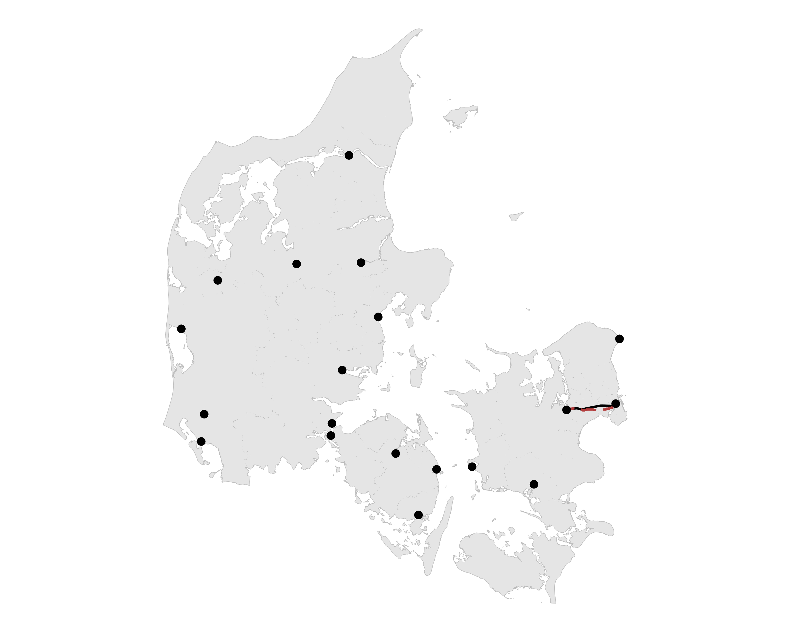
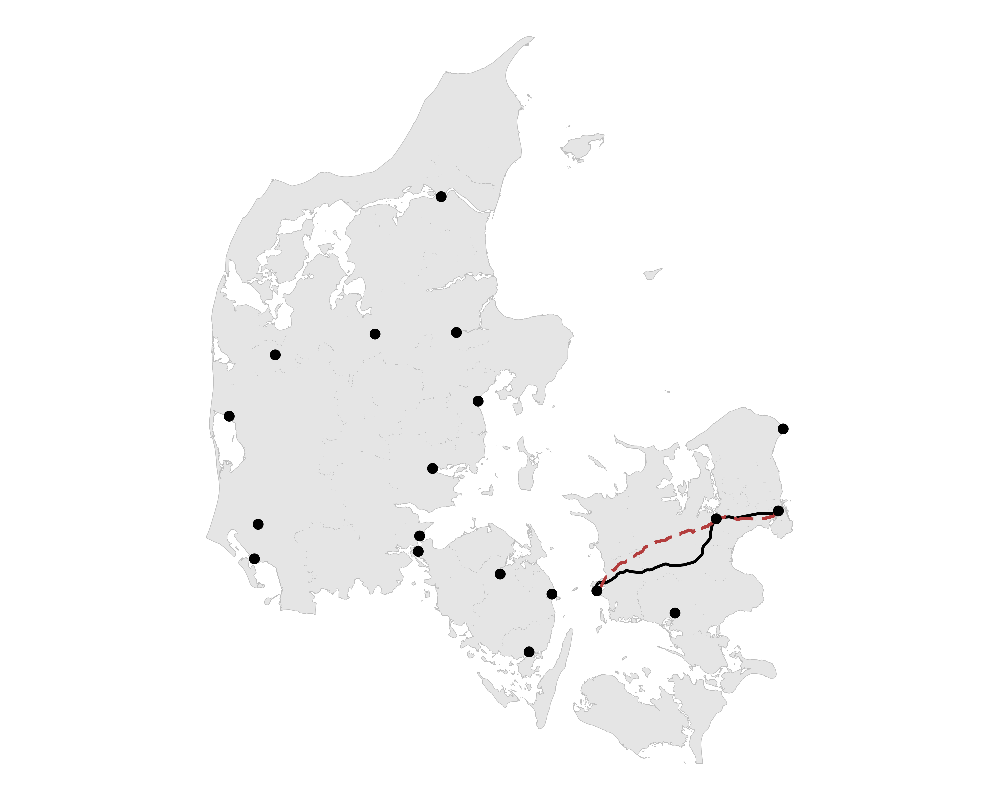
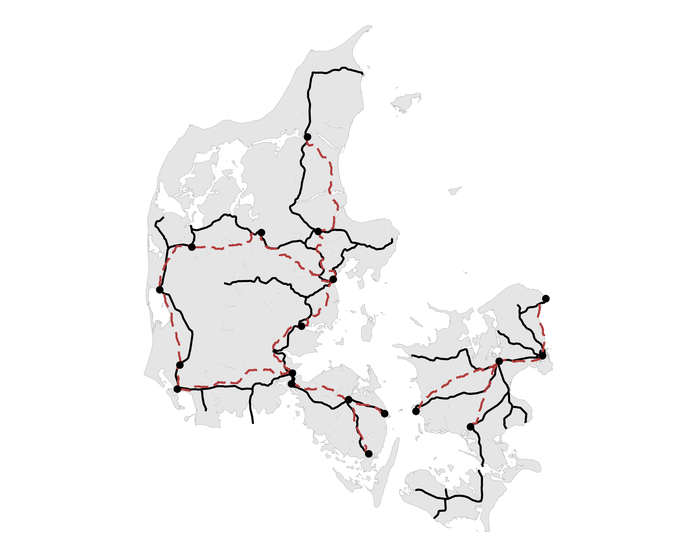
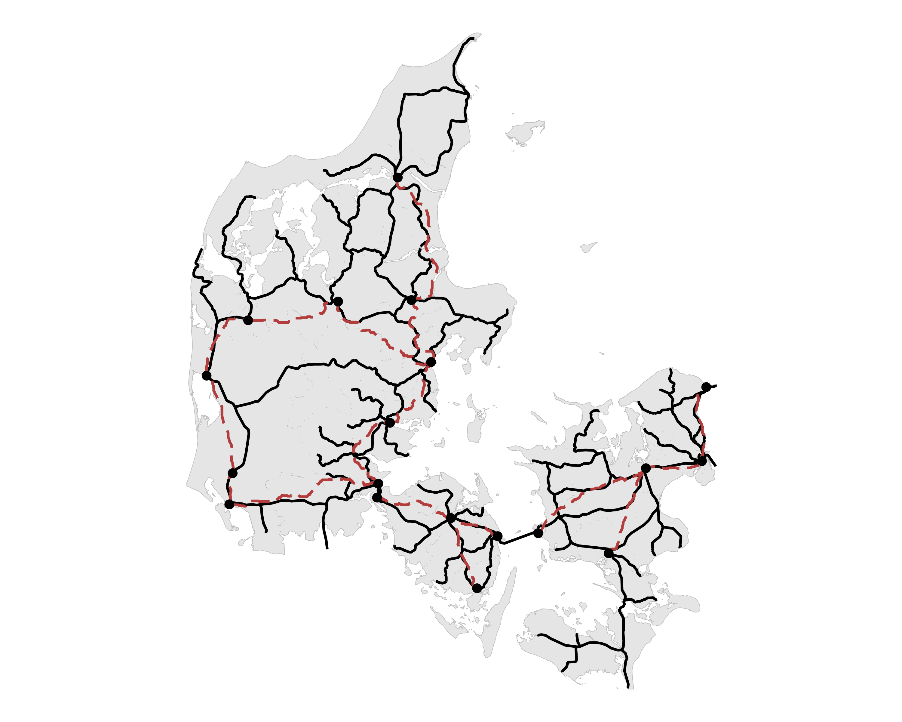
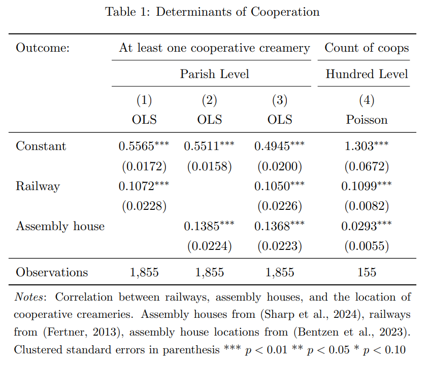
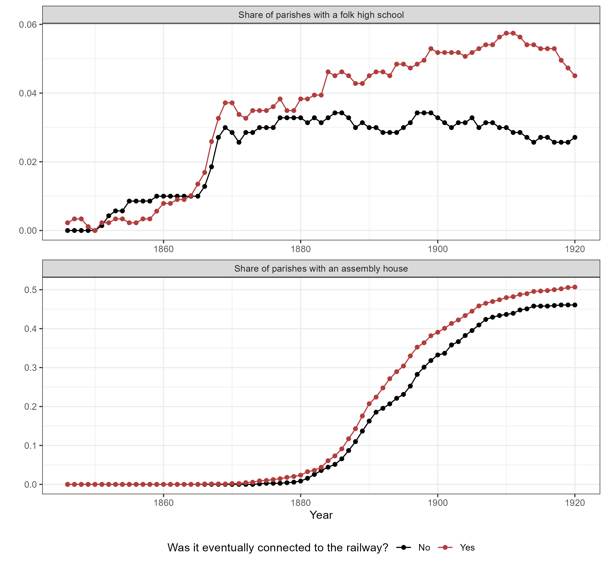
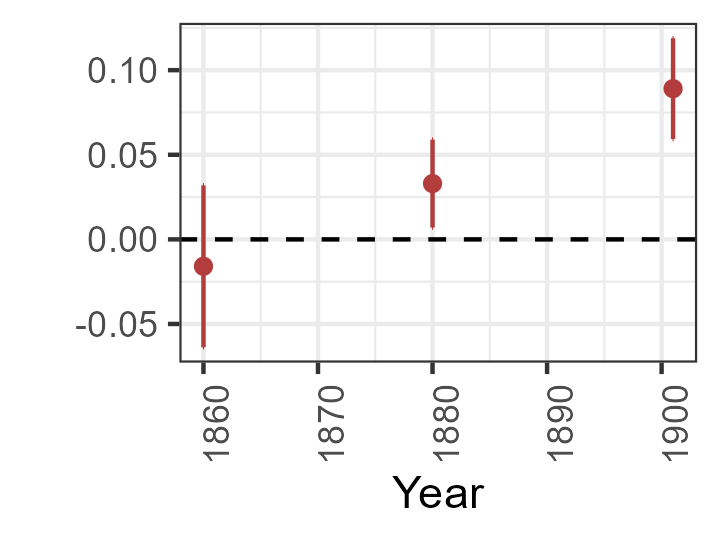
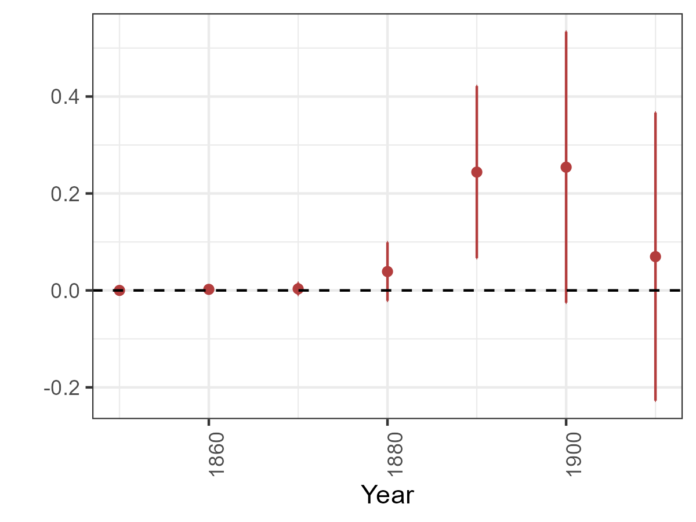
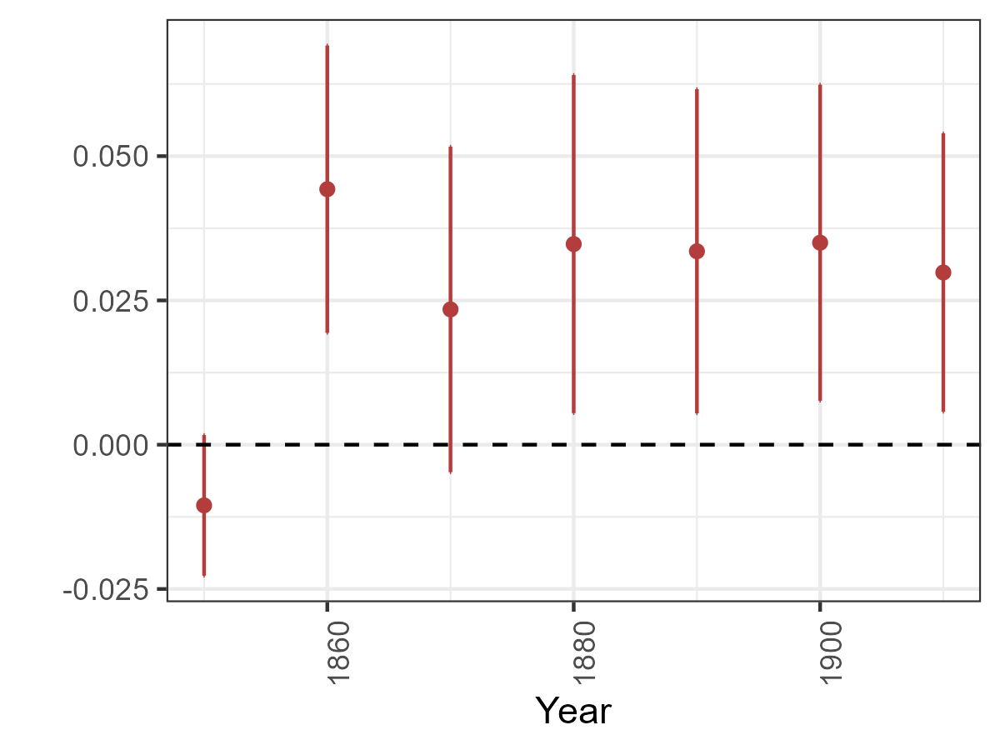

---
output:
  xaringan::moon_reader:
    includes:
      after_body: insert-logo.html
    self_contained: false
    lib_dir: libs
    nature:
      highlightStyle: github
      highlightLines: true
      countIncrementalSlides: false
      ratio: '16:9'
    seal: false
editor_options: 
  chunk_output_type: console
---
class: inverse, middle, center

```{r xaringan-panelset, echo=FALSE}
xaringanExtra::use_panelset()
```

```{r xaringan-tile-view, echo=FALSE}
xaringanExtra::use_tile_view()
```

```{r xaringanExtra, echo = FALSE}
xaringanExtra::use_progress_bar(color = "#808080", location = "top")
```

```{css echo=FALSE}
.pull-left {
  float: left;
  width: 44%;
}
.pull-right {
  float: right;
  width: 44%;
}
.pull-right ~ p {
  clear: both;
}


.pull-left-wide {
  float: left;
  width: 66%;
}
.pull-right-wide {
  float: right;
  width: 66%;
}
.pull-right-wide ~ p {
  clear: both;
}

.pull-left-narrow {
  float: left;
  width: 33%;
}
.pull-right-narrow {
  float: right;
  width: 33%;
}

.small123 {
  font-size: 0.80em;
}

.large123 {
  font-size: 2em;
}

.red {
  color: red
}

.xsmall123 {
  font-size: 0.60em;
}

.pull-center {
  margin-left: auto;
  margin-right: auto;
  width: 50%;
  text-align: left;
}

.pull-center-narrow {
  margin-left: auto;
  margin-right: auto;
  width: 30%;
  text-align: left;
}
```

# Tracks to Modernity
## Railroads, Growth, and Social Movements in Denmark

### Tom Görges, TU Dortmund University
### Paul Sharp, University of Southern Denmark
### Christian Vedel, University of Southern Denmark
### Magnus Ørberg, University of Copenhagen

#### *Updated `r Sys.Date()`*

**Email:** <christian-vs@sam.sdu.dk>; **Twitter/X:** [@ChristianVedel](https://twitter.com/ChristianVedel);  
**BlueSky:** [@christianvedel.bsky.social](https://bsky.app/profile/christianvedel.bsky.social); 
**GitHub:** [github.com/christianvedels/Tracks_to_modernity](https://github.com/christianvedels/Tracks_to_modernity);  
**Paper:** [arxiv.org/abs/2502.21141](https://arxiv.org/abs/2502.21141)

---
# Tracks to modernity

.pull-left-wide[
- Railways brings change but also new ideas
- *RQ*: How did railways contribute to the emergence of modern Denmark?
  + Railways as market expansion
  + Railways as tracks for new ideas to travel on
- Builds on Boberg-Fazlic et al (2023). "Getting to Denmark etc.", which shows how elites explain the emergence of creameries
- We show the contribution of markets and new organisational ideas
]

--

.pull-left-wide[
### Preview of results
- Railways caused pop growth and structural change
- Railways caused the emergence of Grundtvigian *'Assembly Houses'* and *'Folk high schools'*
]


---
# Literature

.pull-left[
.small123[
- Fogel (1964): Social savings reveals small effect
- Atack, Bateman, Haines, Margo, (2010): DiD reveals large effect
- Donaldson & Hornbeck (2016): Market access approach reveals massive effect 
- Berger, Enflo, K. (2017): Large persistent effect in Sweden 
- Berger (2019): No spill-over on population - some spill-over on industry
- Zimran (2020): Urbanization and health
- Bogart, You, Alvarez-Palau, Satchell, Shaw-Taylor (2022): Urbanization and structural change
- Cermeño, Enflo, Lindvall (2022): Railroads, state and schooling
- Melander (2023): Railroads and social movements in Sweden
- Vedel (2024): Water infrastructure: 26 percent population growth in DK

...*So much more*
]
]

.pull-right[

]

---
# "Getting to Denmark"

.pull-left-wide[
### Fukuyama’s idea  
- *Denmark* = shorthand for a **modern, inclusive, well‑governed society** (Fukuyam 2011 2015).  
- Achieving it requires a *trinity*  
  1. **State capacity** – the power to act  
  2. **Rule of law** – the power restrained  
  3. **Accountability** – the people’s voice  
- But how did *Denmark* get to Denmark? - Grundtvigianism and Creameries (and much more)
]

--

.pull-right-narrow[
### Short history
- 1658, 1814, 1864: Denmark is reduced to a small insignificant state
- 1848: First 'democratic' constitution
- 1850-1900: Danish economic take-off (in part via rural industrialisation, Lampe and Sharp, 2019)
- 1901, 1915: Democracy: System change (connected to Gr.) women's suffrage 
]

---
# Railways in Denmark 

.pull-left[
- First line opened between Roskilde and Copenhagen in 1847
- Many lines initiated in Fyn and Jutland by Petro, Brassey and Betts
- Main lines operated as state lines in most of the relevant period
]

.pull-right[
.panelset[
  .panel[.panel-name[1847]
    
  
  ]
  .panel[.panel-name[1860]
    
  
  ]
  .panel[.panel-name[1880]
    
  
  ]
  .panel[.panel-name[1901]
    
  
  ]
]
*Data from Fertner (2013)*

]


---
# Grundtvig's alleged impact on prosperity

.pull-left[
- Community Building: Social capital and trust, trustworthy institutions
- Human capital 
- Cultural identity
- Local democracy and societies
- *"Leave two Danes in a room and they will form at least three societies"*

  
.small123[*Agersnap, H. (1885) Generalforsamling i Ansager Andelsmejeri [wikimedia](https://commons.wikimedia.org/wiki/File:Generalforsamling_i_Ansager_Andelsmejeri.jpg)*]
]

.pull-right[
.small123[
  
C.A. Jensen (1843) 'Nikolaj Frederik Severin Grundtvig'. [Wikimedia commons](https://commons.wikimedia.org/wiki/File:N-f-s-grundtvig-portr%C3%A6t.jpg)
]
]


---
# It's all about butter

.pull-left-narrow[
- The Danish economic take-off follows the emergence of creameries
- They produced butter exported to the UK
- They required inputs - coal imported via railways
- They required new organizational forms - Grundtvigianism
]

.pull-right-wide[
.pull-right-wide[

]
]


---
.pull-left-wide[
# Data
- Census data 1787-1901 (Link lives)
- HISCO codes for census descriptions (Dahl, Johansen, Vedel, 2024)
- Linking with parish borders and consistency (Vedel, 2024)
- Railroads shape files (Fertner 2013)
- Location of assembly houses (Trap 3/4; Bentzen, Boberg-Fazlic, Sharp, Skovsgaard, Vedel, 2023)
]


---
# Empricial strategy

.pull-left[
- Difference in difference
- **Identifying assumption:**
  + Places with railways would have had a parallel developmental path given the absence of railways
  
]

.pull-right[

]

---
# Descriptive evidence

.pull-left[
- Places connected to the railways saw more Grundtvigianism
]

.pull-right[

]

---
# Railways and the Economy
.panelset[
.panel[.panel-name[Railways and the Economy]
.small123[
| |(1) log(Pop)           |(2) log(Child women ratio) |(3) log(Manufacturing 789) |(4) log(hisclass avg) |(5) log(Born different county) |
|:-----------|:-----------|:-----------|:-----------|:-----------|:-----------|
|Connected_rail  |0.0652*** (0.0106) |0.0005 (0.0099)        |0.1202*** (0.0193)     |-0.0018 (0.0020)  |0.1465*** (0.0410)         |
|GIS_ID FE        |Yes                |Yes                    |Yes                    |Yes               |Yes                        |
|Year FE          |Yes                |Yes                    |Yes                    |Yes               |Yes                        |
|Observations    |6,374              |6,352                  |6,357                  |6,373             |6,282                      |
- Classical effect as expected
- Still novel for the DK setting
]

]
.panel[.panel-name[Railways and the Ideas (Grundtvig)]
.small123[
|Dependent Var.: |(1) Assembly house    |(2) log(MA assembly) |(3) High School        |(4) log(MA High) |
|:---------------|:-----------------|:----------------|:-----------------|:----------------|
|                |                  |                 |                  |                 |
|Connected_rail  |0.0560** (0.0185) |-0.0126 (0.0082) |0.0140** (0.0050) |0.0056 (0.0056)  |
|GIS_ID FE       |Yes               |Yes              |Yes               |Yes              |
|Year FE         |Yes               |Yes              |Yes               |Yes              |
|Observations    |100,485           |102,245          |324,005           |324,005          |
- Grudtvigian institutions specifically placed in connected places
]
]
]

.footnote[
.small123[
**This also holds using the CS estimator*
]
]

---
# Dynamics by year

.panelset[
.panel[.panel-name[Population]
.pull-right-wide[.pull-left-wide[

]]

]
.panel[.panel-name[Assembly houses]
.pull-right-wide[.pull-left-wide[

]]
]
.panel[.panel-name[Folk high schools]
.pull-right-wide[.pull-left-wide[

]]
]

]


---
class: middle
# Conclusion
.pull-left[
- We document that railways also had an impact on prosperity in Denmark
- We add a new insight: Railways also spread the core ideas that led to modern Denmark


**Feel free to reach out**
]

.pull-right[

**Email:** <christian-vs@sam.sdu.dk>; **Twitter/X:** [@ChristianVedel](https://twitter.com/ChristianVedel);    
**BlueSky:** [@christianvedel.bsky.social](https://bsky.app/profile/christianvedel.bsky.social);   
**GitHub:** [github.com/christianvedels/Tracks_to_modernity](https://github.com/christianvedels/Tracks_to_modernity);
**Paper:** [arxiv.org/abs/2502.21141](https://arxiv.org/abs/2502.21141)
]


